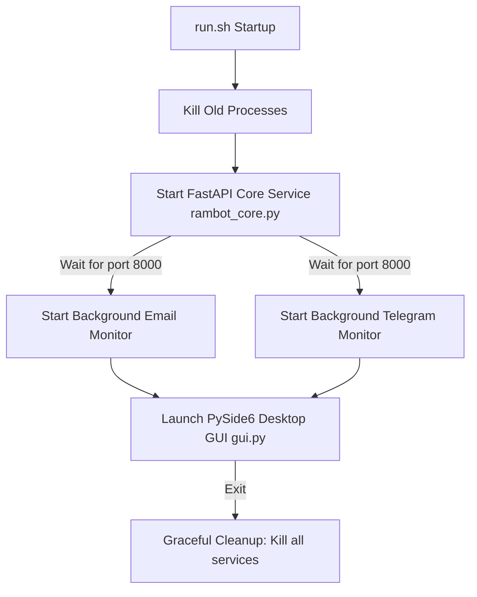

# 🌌 RambotOS

> **RambotOS** is an advanced, unified, agentic AI operating system framework. Acting as a sophisticated, witty, and minimalist electronic butler, RambotOS integrates conversational LLMs, multimodal perception, long-term memory, background service monitoring, multi-channel communication (Email & Telegram), and native OS control into an immersive desktop assistant.

---

## 🎨 System Highlights & User Interface

At first glance, RambotOS offers a state-of-the-art native-web hybrid experience:
- **Rich Dark Aesthetics**: A premium, futuristic, dark-themed user interface utilizing curated HSL color palettes and smooth gradients designed to amaze.
- **Dynamic Interaction**: Vibrant micro-animations, active hover transitions, and responsive visual states.
- **Mini-Orb Mode**: Shrinks the entire application down into a small, elegant interactive orb in the bottom right corner of your screen, blending seamlessly into your desktop.
- **Full-Immersive Mode**: Expand to full-screen to enable immersive layouts like interactive routes, custom maps, or generative UI canvases.

---

## 🏗️ System Architecture & Orchestration

RambotOS is architected as a highly modular, decoupled system. The lifecycle is coordinated through a sequential startup process:



### 🧱 Component Map
- **Central Core (FastAPI Backend)**: Exposes endpoints for gateway chat routing, monitor heartbeat registration, real-time custom notification pushing, skill registration, session mapping, and long-term memory query/deletion.
- **Desktop Client (PySide6 Native GUI)**: Houses a custom Chromium WebEngine page loaded with a modern React/Vite/Tailwind frontend, using **QWebChannel IPC** to bridge native capabilities with the web page.
- **Standalone Monitors (Email & Telegram)**: Independent background services continuously checking inbound communications, mapping incoming identifiers to unified user sessions, and alerting the Core Service.

---

## 🚀 Key Technical Features

### 1. 🧠 Central Gateway Core with Unified Session Mapping
The central core resolves incoming messages from disparate channels (Vite web chat, Email, Telegram) and maps them into a **Unified Session**. 
- Identifiers (e.g., email addresses, Telegram chat IDs) are dynamically linked to persistent user profiles (Master vs. Guests).
- Features a thread-safe deque-based notification gateway to push real-time, priority-rated alerts directly onto the user's UI.

### 2. ⚡ Layered Prompt System (Token Optimized)
The system prompt is assembled dynamically based on context, reducing prompt token overhead by **30-40%** while retaining exceptional intelligence and adherence:
- **Core Identity Layer**: Sets the Rambot persona (brief, proactive, sophisticated).
- **Skill Protocol Layer**: Enforces the dynamic discovery and reading of hot-pluggable skills instead of dumping all instructions at startup.
- **Memory Protocol Layer**: Guides the retrieval and updating of user facts.
- **Communication Style Layer**: Enforces concise, minimalist, and natural responses.
- **Extended Directives Layer**: Integrates Generative UI specifications, image/video model execution guidelines, and map protocols.

### 3. ✂️ Conversation Trimming Middleware
To prevent context window bloat and manage API token consumption, a specialized `trim_memory` LangGraph middleware implements an adaptive sliding window:
- Keeps the system prompt and core instructions intact.
- Automatically trims older interaction rounds, retaining only the **last 5 rounds (Human ↔ AI)** of the active conversation.

### 4. 🧩 Hot-Pluggable Skills Ecosystem
Skills are completely hot-pluggable, stored inside `/skills` as folders carrying a descriptive `SKILL.md` with frontmatter:
- **Discovery**: When a request aligns with any available skill, the agent dynamically triggers `retrieve_skills` and reads the relevant markdown to understand guidelines, action commands, and output formats.
- **Core Suite of Skills**:
  - `agentmail`: Autonomous electronic email butler, replying on behalf of its user.
  - `algorithm-engineer`: Specialized helper for software design and execution.
  - `harness-engineering`: System harness management.
  - `linkedin-job-automator`: Intelligent job discovery and pipeline automation.
  - `resume-cv-builder`: ATS-optimized resume/CV compiler exporting to Markdown, HTML, or PDF.
  - `spotify-controller`: Controls system media and playlists.
  - `stock-market`: Real-time stock market quote queries and analytics.
  - `task-scheduler` & `time-service`: Core calendar, timer, and scheduling operations.
  - `weather`: Real-time local forecasts with custom weather card rendering.
  - `nano-banana`: Built-in image generation tool executing `generate_image.py`.
  - `nano-veo`: Built-in video generation tool executing `generate_video.py` supporting dialogue syncing.

### 5. 💾 SQLite & ChromaDB Dual-Memory Architecture
- **Short-Term Context**: Powered by LangGraph's SQLite checkpointer (`AsyncSqliteSaver`), providing thread-safe, multi-user, conversational history persistence.
- **Long-Term Knowledge**: When the agent detects critical personal facts, preferences, or settings during an interaction, it structured-extracts them into facts using a `MemoryExtraction` model and persists them inside a local **ChromaDB vector store** for semantic retrieval.

### 6. 🌐 Native-Web Hybrid Desktop Bridge (Qt IPC)
- Uses `QWebChannel` via a Python `BackendBridge` to safely expose Slots (e.g., `chat()`, `process_audio()`, `select_file()`, `startNativeLocation()`) to the React frontend.
- Native Qt Signals are emitted back to Vite to trigger immediate, reactive frontend updates (e.g., streaming responses, recognized speech, base64 audio playbacks, location updates).
- Fully integrates system permissions (Camera, Microphone, Geolocation) and folder watchers for immediate hot-reloading during frontend development.

### 7. 👂 Perceptual Services (Ear, Mouth, & Eyes)
- **Voice Activation (Wake Word)**: Runs a low-power background wake-word engine via `pvporcupine` inside a dedicated `WakeWordThread`. The thread automatically pauses while the user is actively speaking or when the agent is busy to prevent feedback loop overlap.
- **Speech Recognition (ASR)**: Uses local, high-speed transcription powered by `Faster-Whisper`.
- **Text-to-Speech (TTS)**: Leverages edge-tts for smooth, neural voice generation, delivering base64 audio directly to the desktop client.
- **Vision & Multi-modal Processing**: Decodes webcam inputs and media attachments via `MediaProcessor` to provide rich visual reasoning.

### 8. 🖱️ Native OS Control (Hands)
- Supports native cursor movement and mouse actions mapped directly from normalized screen positions (`0.0` - `1.0`) via `pyautogui`.
- Allows window state manipulation between Full Immersive and Mini Orb modes directly through chat commands.

---

## 📂 Project Directory Structure

```filepath
RambotOS/
├── rambot_core.py             # FastAPI Backend Core Service & API Gateway
├── gui.py                     # PySide6 desktop client (Chromium WebEngine)
├── launcher.py                # Core launch coordination utilities
├── run.sh                     # Unified system startup and cleanup bash script
├── config/
│   └── config.py              # Central system configuration and API keys
├── core/
│   ├── chat_prompt.py         # Dynamic Layered Prompt Builder
│   ├── history.py             # Conversation history persistence wrappers
│   ├── memory.py              # Long-term ChromaDB memory manager
│   └── skill_index.py         # Skill registry and hot-reloading index
├── agents/
│   ├── langchain_agent.py     # Central LangchainBrain executing agent loops
│   ├── base_agent.py          # Abstract agent definitions
│   └── tool_manager.py        # Automated tool assembler
├── services/
│   ├── asr.py                 # Faster-Whisper automatic speech recognition
│   ├── tts.py                 # Neural Edge-TTS voice generation
│   ├── wakeword.py            # pvporcupine continuous wake-word thread
│   ├── media_processor.py     # Multimodal vision & attachment decoder
│   ├── location_service.py    # Native Geolocation polling
│   ├── email_service.py       # Standalone email polling & drafting
│   └── telegram_service.py    # Telegram bot interaction loops
├── skills/                    # Pluggable skill directories (each with a SKILL.md)
├── tools/                     # Python-native tools linked directly to Langchain
├── frontend/                  # React + Vite + Tailwind CSS Source Code
├── db/                        # Persistent SQLite & ChromaDB directories
├── requirements.txt           # Main python system dependencies
└── LICENSE                    # Apache 2.0 Open Source License
```

---

## 🛠️ Installation & Setup

### 1. Prerequisites
Make sure you have `Python 3.10+` and `Node.js` installed.
For ATS-optimized document conversion, `pandoc` and `xelatex` are highly recommended:
```bash
brew install pandoc
```

### 2. Python Environment Setup
Create a virtual environment and install the required dependencies:
```bash
python3 -m venv .venv
source .venv/bin/activate
pip install -r requirements.txt
```

### 3. Frontend Setup
Navigate into the `frontend` folder, install npm packages, and build the static bundle:
```bash
cd frontend
npm install
npm run build
cd ..
```

### 4. Configuration
Modify `config/config.py` to fill in your API keys, credentials, and user preferences:
- **LLM Models**: Standard chat models use `gemini-3.1-flash-lite-preview` or `gemini-3-flash-preview` for coding.
- **Picovoice Access Key**: Paste your Picovoice wake-word access key.
- **Telegram Bot Token**: Insert your bot token to enable background Telegram monitoring.
- **AgentMail Configuration**: Set up your autonomous mailbox API keys.

---

## 🚀 Running RambotOS

To spin up the entire operating system, simply execute the unified shell script:

```bash
chmod +x run.sh
./run.sh
```

**What happens under the hood:**
1. Shuts down any stale background processes of RambotOS.
2. Launches `rambot_core.py` (FastAPI backend) on `http://127.0.0.1:8000`.
3. Waits sequentially until the port is active.
4. Spawns independent email and Telegram background monitors.
5. Launches the PySide6 desktop window loading the React web client.
6. **Graceful Shutdown**: Once you close the desktop GUI, the bash script automatically stops all background core and monitor processes.

---

## 📄 License
This project is licensed under the Apache 2.0 License - see the [LICENSE](file:///Users/wangpeidong/Documents/RambotOS/LICENSE) file for details.