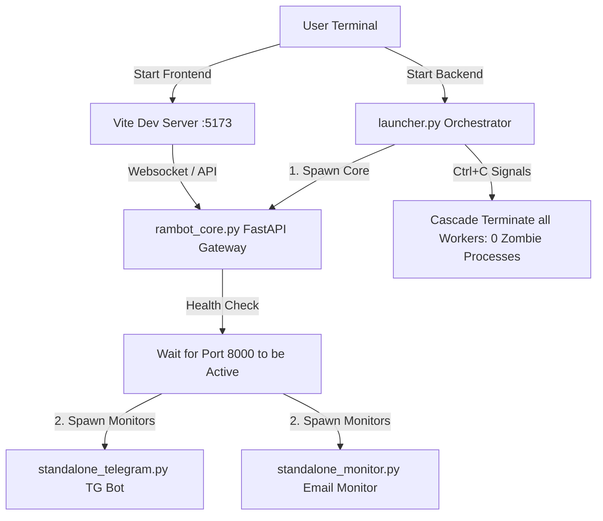

# 🌌 RambotOS - Modern Decoupled Headless AI Butler OS

[中文说明](README_CN.md)

> **RambotOS** is an advanced, unified, and highly cohesive agentic AI operating system framework. Acting as a sophisticated, witty, and minimalist electronic butler, RambotOS integrates conversational LLMs, multimodal perception, dual-track long-term memory (SQLite + ChromaDB vector search), multi-channel background service monitoring (Email & Telegram), and a hot-pluggable skills extension engine, delivering a fully immersive desktop AI assistant experience.

---

## 🎨 Core Design Philosophy & Visual Aesthetics

RambotOS strictly follows modern web standards and an absolute frontend-backend separated architecture, discarding heavy desktop dependencies to embrace a pure web client experience:
*   **Premium Visual Aesthetics**: The frontend UI is meticulously crafted in React + Vite + Tailwind CSS, featuring a tailored dark-theme layout, subtle HSL gradients, and modern Glassmorphism backdrops combined with fluid micro-animations.
*   **100% Pure Headless Backend**: PySide6 and Qt framework dependencies have been entirely decoupled. The backend runs strictly as a clean terminal process manager, responsive and ready for headless server deployments.
*   **Credential Environment Isolation**: Sensitive keys (API Keys, Bot Tokens) are isolated in a local `.env` file, protected by Git exclusion filters, preventing accidental credentials leakage.

---

## 🏗️ System Architecture & Orchestration

RambotOS is designed with a cohesive multi-layered architecture. The backend services' lifecycles are orchestrated through a unified process manager `launcher.py`:



### 🧱 Component Breakdown
*   **Central Gateway Core (FastAPI Core)**: Exposes endpoints for gateway chat routing, monitor heartbeat registration, real-time priority notification queuing, skill index auto-loading, and semantic memory search.
*   **Telegram Bot Agent (Standalone Telegram)**: A background worker handle interacting with the user on IM channels, forwarding triggers seamlessly back to the FastAPI Core.
*   **Smart Email Butler (Standalone Email)**: An independent mail listener checking incoming mail, drafting responses autonomously, and replying on behalf of the user.
*   **Web Client (Vite React Frontend)**: An exquisite frontend chat terminal and generative UI interaction canvas.

---

## 🚀 Key Technical Highlights

### 1. 🧠 Unified Session Mapping & Priority Notification Gateway
*   Dynamically maps conversations originating from different communication channels (Web client, Email, Telegram bot) into a Unified Session, distinguishing Master and Guest privileges.
*   Features a thread-safe deque-based notification gateway to push real-time, priority-rated alerts directly onto the user's UI.

### 2. ⚡ Layered Prompt System (Token Savings up to 30%-40%)
The system prompt is assembled dynamically at runtime, dramatically reducing token overhead:
*   **Core Identity Layer**: Emphasizes Rambot's witty, concise, and proactive personality.
*   **Skill Protocol Layer**: Avoids listing all skill instructions at startup; instead, dynamically index them as needed.
*   **Memory Retrieval Layer**: Interweaves semantic facts from the vector store matching the current dialogue context.
*   **Extended Directives Layer**: Integrates Generative UI protocols and multimodal directives.

### 3. ✂️ Conversation Trimming Middleware
Leveraging LangGraph, a specialized `trim_memory` middleware handles sliding window compression:
*   Perfectly preserves initial system prompts and core instruction blocks.
*   Automatically trims older conversations, keeping only the **last 5 rounds (Human ↔ AI)** of the active history to save context tokens.

### 4. 🧩 Hot-Pluggable Skills Ecosystem
All advanced skills are pluggable, saved in `/skills` folders carrying a descriptive `SKILL.md` file. The AI dynamically discovers and reads these guidelines to fulfill tasks:
*   `agentmail`: Autonomous email manager replying to incoming mails.
*   `algorithm-engineer`: In-depth code generation and system analysis tool.
*   `linkedin-job-automator`: Intelligent job discovery and pipeline automation.
*   `resume-cv-builder`: ATS-optimized resume builder exporting to Markdown, HTML, or PDF.
*   `spotify-controller`: Controls media players and tracks.
*   `stock-market`: Real-time stock market quotes and analytics.
*   `task-scheduler` & `time-service`: Timer, calendar, and scheduled triggers (e.g., water reminders).
*   `nano-banana` & `nano-veo`: Native image and dialogue-synced video models.

### 5. 💾 SQLite & ChromaDB Dual-Memory Architecture
*   **Short-Term History**: Powered by LangGraph's SQLite saver (`AsyncSqliteSaver`), providing secure, multi-threaded conversational persistence.
*   **Long-Term Semantic Memory**: During conversations, the agent automatically extracts key facts about the user's setup and preferences via a `MemoryExtraction` model, saving them to a local **ChromaDB vector store** for semantic retrieval in future chats.

### 6. 👂 Pure Native Perceptual Threading
*   **Headless Voice Activation**: Continuously runs a low-power wake-word engine via `pvporcupine` using standard Python `threading.Thread`, fully replacing the legacy PySide6 `QThread` mechanisms.
*   **Speedy Local ASR**: Millisecond-level local speech-to-text transcriptions powered by `Faster-Whisper`.
*   **Fluid Neural TTS**: Conversational voice responses using Microsoft's neural `edge-tts`, delivering natural voice generation.

---

## 📂 Project Directory Structure

```filepath
RambotOS/
├── launcher.py                # Process scheduler & monitor daemon (Main Entrance)
├── rambot_core.py             # FastAPI Core & API Gateway Service
├── standalone_telegram.py     # Standalone Telegram Bot worker
├── standalone_monitor.py      # Standalone Email Monitor worker
├── backend/                   # 🚀 Unified backend code package (sys.path injected)
│   ├── config/                # System configuration & .env credentials parser
│   ├── core/                  # Prompt builders, histories, ChromaDB managers
│   ├── agents/                # LangGraph agents & tools manager
│   ├── services/              # ASR, TTS, wakewords, mail, and TG services
│   ├── tools/                 # Native Python Langchain tool suites
│   ├── tasks/                 # Task schedulers & automated cron jobs
│   ├── db/                    # Local persistent storages (SQLite & Chroma)
│   └── utils/                 # Public utils
├── frontend/                  # React + Vite + Tailwind CSS Frontend UI source
├── skills/                    # Pluggable skill guidelines (SKILL.md)
├── tests/                     # Historic testing and integration scripts
├── requirements.txt           # Pure backend dependencies (PySide6 decoupled)
├── .env                       # Local secrets template (Git ignored)
└── LICENSE                    # Apache 2.0 License
```

---

## 🛠️ Setup & Installation Guide

### 1. Prerequisites
*   `Python 3.10+` and `Node.js 18+` are required.
*   `pandoc` is highly recommended for document building tools:
    ```bash
    brew install pandoc
    ```

### 2. Python Environment Setup
Create a virtual environment and install the dependencies:
```bash
python3 -m venv .venv
source .venv/bin/activate
pip install -r requirements.txt
```

### 3. Frontend Setup
Install npm packages inside the `frontend` folder:
```bash
cd frontend
npm install
cd ..
```

### 4. Credential Config `.env`
Create a `.env` file at the project root and fill in your keys (fully protected by Git exclusion filters):
```env
# Gemini LLM API Key
GEMINI_API_KEY=your_gemini_api_key_here

# Picovoice Wake-word Access Key
PICOVOICE_ACCESS_KEY=your_picovoice_key_here

# Telegram Bot Token 
TELEGRAM_TOKEN=your_telegram_bot_token_here

# Email Auth (SMTP authorization code or AgentMail credentials)
AGENTMAIL_API_KEY=your_agentmail_key_here
```

---

## 🚀 Running RambotOS

RambotOS supports highly efficient frontend-backend separated startup. You need to open two terminal windows:

### Step 1: Start the Headless Backend Services
In your first terminal, run:
```bash
./.venv/bin/python launcher.py
```
> [!IMPORTANT]
> This command spawns the **FastAPI Core (Port 8000)**, **Telegram Bot**, and **Email Monitor** workers under a clean python supervisor.
> Press **`Ctrl + C`** in this terminal to gracefully terminate all child processes and release port 8000 instantly.

### Step 2: Start the Web UI Development Server
In your second terminal, navigate into the frontend folder and run the dev server:
```bash
cd frontend
npm run dev
```
> [!TIP]
> The Web UI will be active at `http://localhost:5173/` and will automatically link to the local backend at `http://localhost:8000/`. Enjoy your streamlined smart AI Butler system!

---

## 📄 License
This project is licensed under the Apache 2.0 License - see the [LICENSE](LICENSE) file for details.