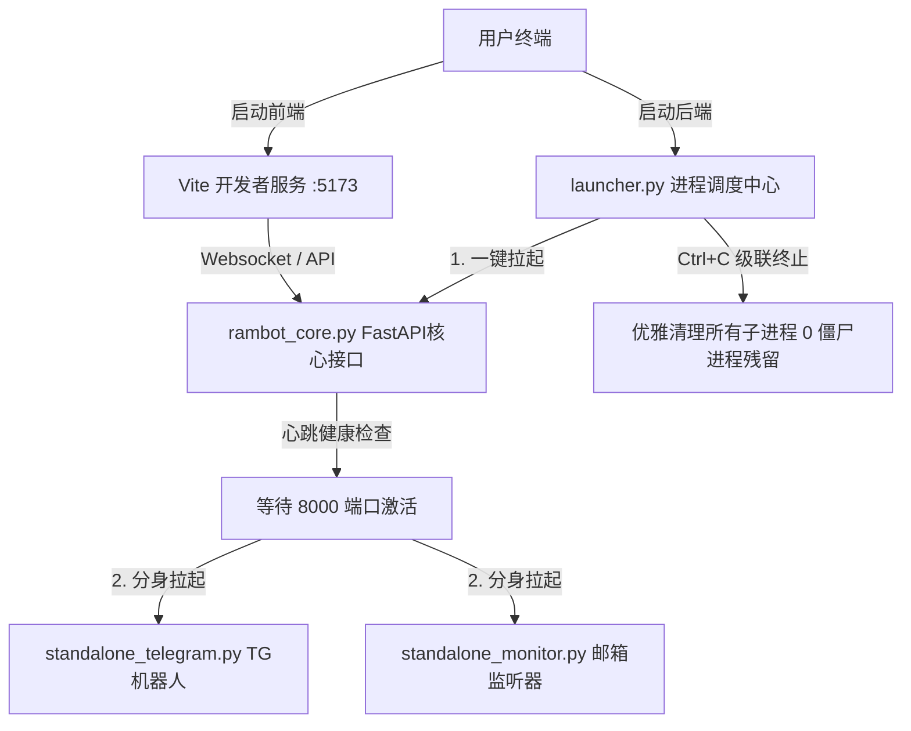

# 🌌 RambotOS - 现代化纯净前后端分离 AI 智能管家操作系统

[English README](README.md)

> **RambotOS** 是一款先进、模块化、高内聚的个人 AI 智能管家操作系统框架。作为一个幽默风趣、极简且无感贴心的电子管家，RambotOS 深度集成了大语言模型多轮对话、多模态感知、双轨长期记忆（SQLite + ChromaDB 向量检索）、多渠道主动式后台服务监听（Email 邮件 & Telegram 机器人）以及插件化技能扩展系统，为您提供沉浸式的智能助理体验。

---

## 🎨 核心设计理念与视觉美学

RambotOS 遵循现代化的 Web 设计规范与极致的前后端分离架构，移除了笨重的桌面客户端依赖，拥抱纯粹的 Web 体验：
*   **极致视觉美学**：前端基于 React + Vite + Tailwind CSS 精心雕琢，使用和谐温润的 HSL 配色方案与现代玻璃微光质感（Glassmorphism），搭配丝滑的微交互动画，带来无与伦比的视觉冲击力。
*   **100% 纯净 headless 后端**：彻底剥离了 PySide6 / Qt 桌面 GUI 框架及图形库依赖，后端整体蜕变为纯粹的命令行常驻服务，极速响应，支持无头服务器部署。
*   **安全凭证隔离**：将 API Key、Bot Token 等敏感信息彻底抽离至本地 `.env` 环境变量配置文件中，受 Git 规则严密保护，永无凭证泄露之忧。

---

## 🏗️ 系统架构设计与进程编排

RambotOS 采用高内聚、低耦合的分层架构。系统的启动与生命周期由统一 of Python 进程调度中心 `launcher.py` 进行精细编排：



### 🧱 核心组件分布
*   **AI 调度中枢 (FastAPI Core)**：负责全局聊天路由网关、多渠道会话统一映射、记忆动态提取与检索、技能热拔插发现以及实时优先级通知网关。
*   **Telegram 机器人分身 (Standalone Telegram)**：独立运行 of Telegram Bot 线程，负责与主人的 IM 会话交互，主动将消息映射并推送至 AI Core。
*   **邮箱智能管家 (Standalone Email)**：独立运行 of 邮件长轮询监听器，能够自动识别主人来信并代理拟写、发送回复。
*   **Web 客户端 (Vite React Frontend)**：精致的前端聊天与生成式 UI 交互画布。

---

## 🚀 核心技术突破

### 1. 🧠 统一会话映射与优先级通知网关
*   能够将来自 Vite Web 界面、邮件、Telegram 机器人的不同通信渠道账号动态关联至同一个统一会话中，并智能区分主人（Master）与访客（Guest）权限。
*   设计了基于线程安全双端队列（Deque）的通知网关，支持不同评级的警报消息实时推送到用户的 Web 界面。

### 2. ⚡ 层级化 Prompt 体系（Token 节省达 30%-40%）
系统 Prompt 采用运行时动态拼接设计，极大减少了初始上下文的 Token 浪费：
*   **核心身份层 (Core Identity)**：确立 Rambot 睿智、言简意赅且主动关怀的管家性格。
*   **技能发现层 (Skill Protocol)**：无需在启动时塞入所有技能说明，而是按需动态扫描并加载。
*   **记忆提取层 (Memory Protocol)**：动态织入当前会话相关的历史记忆碎片。
*   **Extended 交互层**：动态匹配并输出生成式 UI 协议与媒体指令。

### 3. ✂️ 上下文滑动裁剪中间件
通过 LangGraph 深度定制的 `trim_memory` 中间件，自动对长对话进行无感裁剪：
*   完美保留系统首轮 prompt 与核心指令。
*   自动平滑截断，仅保留最近 **5 轮 (Human ↔ AI)** 的活跃对话，防止上下文窗口膨胀和 API Token 的冗余消费。

### 4. 🧩 插件化热插拔技能库 (Skills Ecosystem)
所有高阶能力均作为独立插件存储于根目录的 `/skills` 文件夹下，拥有统一的 `SKILL.md` 规范。AI 在对话中遇到匹配任务时，会实时动态阅读对应 Markdown 来获取运行指令：
*   `agentmail`：自主代发代收的邮件机器人。
*   `algorithm-engineer`：代码深度编写与架构分析。
*   `linkedin-job-automator`：简历自动投递与投递管道管理。
*   `resume-cv-builder`：ATS 友好的 PDF/HTML 简历自动生成器。
*   `spotify-controller`：系统媒体和播放列表控制器。
*   `stock-market`：实时股市行情分析。
*   `task-scheduler` & `time-service`：全局定时任务及日历管家（如“提醒喝水”、“早报简报”）。
*   `nano-banana` & `nano-veo`：底层驱动的图片及视频生成模型。

### 5. 💾 SQLite & ChromaDB 双轨长期记忆架构
*   **短期上下文安全检查**：由 LangGraph 的 SQLite checkpointer (`AsyncSqliteSaver`) 提供支持，确保多用户多线程历史会话的安全持久化。
*   **长期记忆事实检索**：AI 在交谈中会自动通过 `MemoryExtraction` 事实抽取模型提炼主人的偏好 and 设定，并将其写入本地的 **ChromaDB 向量数据库** 中，在后续对话中通过语义向量检索（Embedding）实时唤醒记忆。

### 6. 👂 纯净原生的 Perceptual 线程
*   **无 GUI 语音唤醒**：通过 `pvporcupine` 在后台运行低功耗唤醒监听，由纯 Python 的 `threading.Thread` 提供安全的多线程支持，彻底移除了对旧版 PySide 线程的依赖。
*   **极速本地 ASR**：基于 `Faster-Whisper` 实现本地毫秒级的高精语音转文字。
*   **流畅 TTS**：通过 `edge-tts` 调用微软神经网络语音，生成极具自然感的拟人声音输出。

---

## 📂 项目目录结构说明

```filepath
RambotOS/
├── launcher.py                # 统一进程守护与调度管理器 (核心启动入口)
├── rambot_core.py             # FastAPI 后端核心网关与 API 接口服务
├── standalone_telegram.py     # 独立 Telegram 机器人监听入口
├── standalone_monitor.py      # 独立 Email 邮件监听入口
├── backend/                   # 🚀 统一内聚后端源码包 (sys.path 动态注入)
│   ├── config/                # 系统中心化配置 (.env 环境变量解析)
│   ├── core/                  # AI 大脑核心 (Prompt/历史/ChromaDB/技能索引)
│   ├── agents/                # LangGraph 核心智能代理决策器
│   ├── services/              # 后台核心服务 (ASR/TTS/唤醒词/邮件/TG服务)
│   ├── tools/                 # Python 原生 Langchain 工具集
│   ├── tasks/                 # 定时调度后台任务
│   ├── db/                    # 本地持久化数据库存储 (SQLite/Chroma)
│   └── utils/                 # 公共工具库
├── frontend/                  # React + Vite + Tailwind CSS 前端网页源码
├── skills/                    # 可热插拔的 markdown 技能包
├── tests/                     # 历史与集成调试测试脚本
├── requirements.txt           # 清理 PySide6 后的纯净 Python 依赖包
├── .env                       # 本地凭证文件 (Git 自动忽略)
└── LICENSE                    # Apache 2.0 开源许可协议
```

---

## 🛠️ 快速安装与配置说明

### 1. 系统前置要求
*   建议使用 `Python 3.10+` 和 `Node.js 18+`。
*   对于高级 PDF/HTML 转换能力，推荐安装 `pandoc`：
    ```bash
    brew install pandoc
    ```

### 2. 后端虚拟环境与依赖安装
在项目根目录下创建 Python 虚拟环境并安装纯净的后端依赖：
```bash
python3 -m venv .venv
source .venv/bin/activate
pip install -r requirements.txt
```

### 3. 前端安装依赖
进入 `frontend` 文件夹并安装依赖：
```bash
cd frontend
npm install
cd ..
```

### 4. 凭证文件 `.env` 配置
在项目根目录下创建一个命名为 `.env` 的文件，填入您本地的 API 密钥及账号凭证（程序已配置 Git 忽略该文件，保证安全）：
```env
# Gemini LLM API Key
GEMINI_API_KEY=your_gemini_api_key_here

# Picovoice 语音唤醒 Access Key
PICOVOICE_ACCESS_KEY=your_picovoice_key_here

# Telegram 机器人 Token 
TELEGRAM_TOKEN=your_telegram_bot_token_here

# 邮箱监听与代发凭证 (AgentMail 或者是您邮箱的 SMTP 授权码)
AGENTMAIL_API_KEY=your_agentmail_key_here
```

---

## 🚀 启动 RambotOS 智能管家

RambotOS 支持现代化的高效前后端分离开发与运行，您需要开启两个终端窗口：

### 第一步：启动常驻后端服务 suite
在项目根目录下，直接执行：
```bash
./.venv/bin/python launcher.py
```
> [!IMPORTANT]
> 此命令将一键在您的终端里拉起 **FastAPI 核心 (8000 端口)**、**Telegram 机器人** 和 **Email 监听分身**，前台会持续为您打印心跳与心率监测。
> 当您需要关闭时，**在终端中按下 `Ctrl + C` 即可 1 秒内优雅清理所有子进程，绝无端口占用**。

### 第二步：启动前端可视化网页
在另一个终端窗口中，进入前端工程并启动 Vite：
```bash
cd frontend
npm run dev
```
> [!TIP]
> 您的前端网页将运行在 `http://localhost:5173/`。它会自动链接本机的 `8000` 端口后端服务，开启流畅无比的网页智能管家体验！

---

## 📄 开源许可证
本项目基于 Apache 2.0 许可证开源 - 详情请参阅 [LICENSE](LICENSE) 文件。
